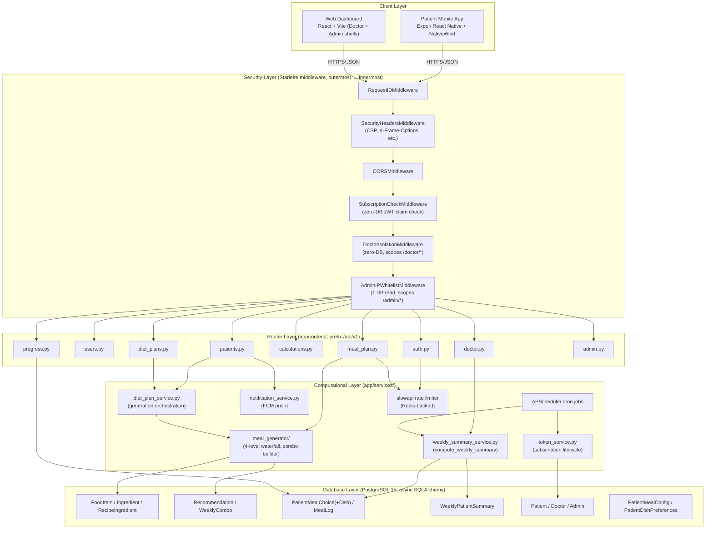
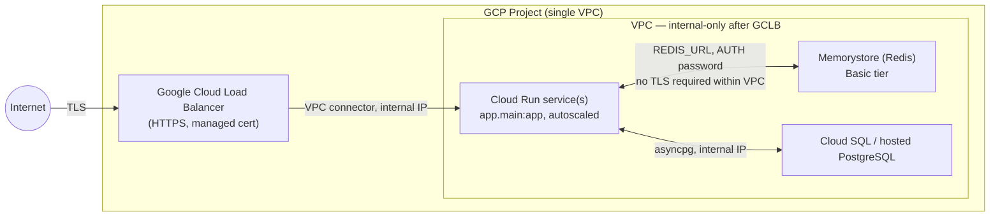

# Mityahar — System Architecture Overview

High-level technical overview of Mityahar's production architecture: an AI-assisted dietetics platform connecting patients, doctors, and admins through one FastAPI backend and two client apps.

> For a deep, line-referenced audit of the data model and generation-layer internals, see `docs/system_architecture.md` (2026-06-15 audit — predates the WeeklyCombo/84-combo v2 system described below, added Session 21).

---

## 1. System Diagram

---

## 2. Interaction Flows

### 2.1 Onboarding & TDEE splits

1. Patient completes onboarding screens in the mobile app (`(onboarding)/personal-info`, `activity-level`, `dietary-preferences`, `allergies`, `goals`, `medical-conditions`, `disclaimer`) and submits `POST /api/v1/patients/onboarding`.
2. `patients.py` derives age from `date_of_birth`, then calls `calculate_bmr()` → `calculate_tdee(bmr, activity_level)` → `calculate_bmi()` (`app/services/meal_generator/calculations.py`).
3. Patient profile fields (gender, height, weight, activity level, diet type, region, health conditions, goals) are persisted in one `UPDATE`.
4. A background task is scheduled on the same request: `diet_plan_service.generate_diet_plan()` → `store_diet_plan()`, committed on a separate background session so onboarding returns immediately (idempotent — safe if retried).
5. On completion, `notification_service.notify_plan_ready()` fires an FCM push to the patient device (best-effort — failures are logged, never raised).
6. Default TDEE split is **Breakfast 25% / Lunch 35% / Dinner 25% / Buffer 15%**, applied against `effective_tdee = tdee × 0.85`. A doctor can override the split per patient via `PatientMealConfig`; the 15% buffer share stays constant regardless of split adjustments (see §2.3).

### 2.2 Dynamic 84-combo plan generation & doctor approval gate

1. `diet_plan_service.generate_diet_plan()` invokes the singleton `meal_generator` (`app/services/meal_generator/meal_generator.py`).
2. For each of 7 days × 3 slots (Breakfast/Lunch/Dinner), the generator builds **4 whole-meal combos**, giving 84 `WeeklyCombo` rows per plan — each combo scores dishes through a 4-level food-lookup waterfall (full filters + weekly memory → drop weekly memory → drop both memory sets with a calorie-range fallback → drop everything except diet-type/plan-type) so a plan can never fail to fill a slot.
3. Diet-type hierarchy waterfall governs dish eligibility: Non-Vegetarian → Non-Veg pool → Eggetarian → Vegetarian; Eggetarian → Eggetarian → Vegetarian; Vegetarian is a hard floor. A weekly non-veg budget (`min(nonveg_meals_per_week, 4)`) is pre-shuffled across Lunch/Dinner slots so no predictable pattern emerges.
4. Exclusion sets are enforced per candidate: `daily_used_ids` (hard, resets daily), `weekly_used_ids` (soft, dropped at waterfall level 2), `blocked_food_ids` (doctor-blocked, never dropped), `allergies` (never dropped), and `patient_avoid_tags` (medical-condition-derived, never dropped).
5. Each combo's calories are scaled to the patient's per-slot target: `factor = target_cal / cal_per_serving`, clamped to `[0.5, 3.0]`.
6. The plan is persisted as `generation_version=2` with `Recommendation.meals=[]` and 84 populated `WeeklyCombo` rows, `approval_status="draft"`.
7. **Doctor approval gate:** a draft plan is not patient-visible. It surfaces under `GET /doctor/pending-approvals`; the doctor reviews via `GET /doctor/patients/{id}/weekly-plan`, may swap individual combos (`POST /doctor/patients/{id}/weekly-plan/combos/{combo_id}/swap`), then flips the gate with `POST /doctor/patients/{id}/weekly-plan/approve`, which transitions `approval_status: draft → approved` and notifies the patient. Only one `Recommendation` is `is_active=True` per patient at a time; regeneration soft-deletes the prior row.

### 2.3 Patient mobile app — adaptive selections & dual-budget buffer tracking

1. The Home/Meals tabs fetch `GET /meal-plan/suggestions/{date}/{meal_type}`, presenting the 4 pre-generated combos for that slot as swipeable cards.
2. Patient confirms one via `POST /meal-plan/confirm-choice` (optionally with a bowl size S/M/L), which writes a `PatientMealChoice` + `PatientMealChoiceDish` row — an optimistic UI update reflects the confirmed state immediately, reconciled against `GET /meal-plan/choices/{plan_date}` on refetch.
3. **Budget 1 — planned/slot budget:** each confirmed combo's `scaled_calories` count against that slot's target from the TDEE split (Breakfast/Lunch/Dinner).
4. **Budget 2 — passive buffer:** the remaining 15% of `effective_tdee` is a passive allowance, not tied to any generated slot. It exists to absorb casual snacking and is not deducted unless the patient explicitly logs a snack (Home tab quick-log: calorie presets of 50/100/200/300 kcal or free numeric entry, logged as `MealLog` with `meal_type="Snack"`).
5. Logging a snack deducts from the buffer in real time — the mutation invalidates the day's query cache so "remaining budget" on the Home tab reflects the new total immediately, without a full page reload.
6. This dual-budget split (structured plan calories vs. passive buffer) is what lets the generator stay deterministic (fixed 84-combo pool) while still tolerating real-world off-plan eating without forcing a regeneration.

### 2.4 Weekly adaptive feedback loop (`compute_weekly_summary`)

1. Trigger points: on-demand via `GET /doctor/patients/{id}/weekly-summary?week_start=`, or automatically every Sunday 01:00 UTC via the `complete_expired_plans()` cron job.
2. `compute_weekly_summary(db, patient_id, week_start)` (`app/services/weekly_summary_service.py`) resolves the actual week window from the patient's **active** `Recommendation.week_start_date` (not the caller-supplied Monday), with a historical fuzzy fallback when no active plan exists for that window.
3. It joins `PatientMealChoice` / `PatientMealChoiceDish` against the 84 `WeeklyCombo` rows to compute, per day: planned vs. confirmed calories, and per dish: `times_selected` vs `times_offered` (offered = how many days that dish appeared across the 4-combo pool).
4. From dish frequency it derives behavioral patterns: `preferred_dishes` (`times_selected >= 2`), `never_selected_dishes` (`times_selected == 0` with `times_offered >= 3`), plus most/least-selected dish and average bowl size for the week.
5. The result is upserted into `WeeklyPatientSummary` (idempotent — safe to recompute any number of times) and returned to the doctor dashboard's Weekly Summary tab, which reads `data.per_day` and the `pattern` block.
6. This summary closes the loop back into generation: the next plan's generator run reads `PatientDishPreferences` (doctor pin/block) informed by the prior week's `preferred`/`never_selected` patterns, boosting recurring favorites and excluding consistently-skipped dishes — without carrying forward the raw `weekly_used_ids` exclusion set (removed after it was found to snowball and collapse variety across weeks).

---

## 3. Production Networking Topology

- **Edge:** GCLB terminates TLS and forwards to Cloud Run over the internal VPC connector. `TRUSTED_PROXY_CIDR` (`app/core/config.py`) is set to the GCP load-balancer's IP range so the rate limiter can trust `X-Forwarded-For` from the LB — without it, all requests behind the LB resolve to the same internal IP and per-client rate limiting collapses (a gap identified locally, since Locust workers on `127.0.0.1` shared one bucket).
- **Rate-limit synchronization:** `slowapi` (`app/core/limiter.py`) backs onto Memorystore in production instead of in-memory storage. This is required the moment Cloud Run scales past one instance — in-memory counters are per-process, so without a shared Redis store each instance would enforce its own independent limit, silently multiplying the effective rate cap by instance count. `REDIS_URL=redis://:<AUTH_PASSWORD>@<MEMORYSTORE_IP>:6379/0`, same VPC as Cloud Run, TLS not required for Basic tier within the VPC boundary.
- **Database:** asyncpg connects to Cloud SQL/hosted PostgreSQL over the internal IP, same VPC — no public IP exposure.
- **Startup safety:** the app performs a Redis `PING` during FastAPI lifespan startup and logs loudly (not silently) if `REDIS_URL` is set but unreachable, since a silent fallback to in-memory storage in production would defeat multi-instance rate-limit sharing without any visible signal.
- **Production `.env` deltas from dev:** `COOKIE_SECURE=True`, `REQUIRE_EMAIL_VERIFICATION=True`, `ALLOW_HARD_DELETE=False`, `REDIS_URL` pointed at Memorystore, `TRUSTED_PROXY_CIDR` set to the GCLB range.
